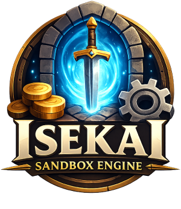

  

# Isekai Sandbox Engine

A systemic RPG sandbox engine built around deterministic mechanics, modular systems, and a dynamic economy.

The goal is to create a living simulation where the player can act as an artisan, merchant, property owner, explorer, or dungeon runner — without relying on AI for mechanical logic.

---

## 🎯 Vision

Build a systemic sandbox where:

- The player can live as an artisan, merchant, adventurer, or noble.
- The economy is dynamic and region-based.
- The labyrinth operates as an independent system.
- AI handles narration and dialogue only.
- All mechanics are deterministic and controlled by the JS engine.

---

## 🧱 Current Scope

The engine is designed as a modular, backend-independent core.

### Core
- `GameState` – Single, fully serializable world state.

### Engines Implemented
- `MarketEngine`
  - Dynamic pricing per city
  - Supply/demand indexes
  - Local taxes
  - Buy/sell spread
  - Daily fluctuations
  - Event hooks

- `TransactionEngine`
  - Centralized inventory and money handling
  - Structured transaction receipts

- `CraftEngine`
  - Deterministic recipe system
  - Ingredient consumption
  - Time and gold costs
  - Refined item production

- `PropertyEngine`
  - Property acquisition
  - Per-property storage
  - Deposit / withdraw mechanics

- `TimeEngine`
  - Minute / hour / day progression
  - Automatic daily market updates

---

## 💰 Economic Model (v0)

Final price formula:

basePrice × cityIndex × (1 + tax) × spread

Constraints:
- Index bounded between 0.7 and 1.3 (v0)
- Sell spread < Buy spread
- Prices rounded to whole units

---

## 🚧 Next Milestones

- XP / LevelEngine v1
- LabyrinthEngine v1
- ContractEngine v1
- UI implementation (solo version)

See `ARCHITECTURE.md` for the full long-term roadmap.

---

## 🏗 Project Phases

1. **Solo Application**
  - Local save
  - Web UI
  - Fully playable sandbox loop

2. **Web Application**
  - Backend API
  - Multi-session support
  - Persistent world state

3. **Mobile Extension**
  - PWA or React Native adaptation

The Core Engine remains unchanged across all phases.

---

## 🤖 AI Philosophy

AI is strictly separated from mechanical logic.

Flow:

AI → proposes narrative intent  
Engine → validates mechanics  
GameState → updated  
AI → narrates result

AI never directly modifies the game state.

---

## 🧠 Development Principles

- Small stable modules
- Clear branch-per-feature workflow
- Deterministic mechanics
- No premature abstraction
- Progressive expansion

---

## 🎨 Logo

The project logo was generated using AI and is used for illustrative purposes.
Final branding may evolve over time.

---

## 📌 Status

Version: `core-systems-foundation`  
Status: Economy, crafting, property, and time systems operational.

> Active development happens on the `develop` branch.
